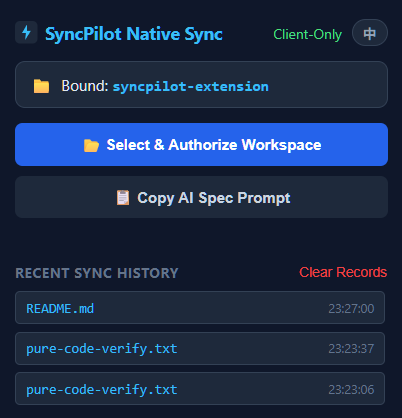
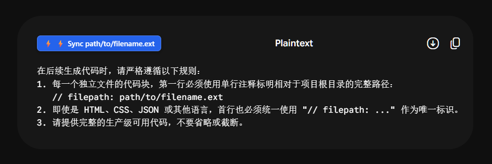

# SyncPilot ⚡

> **Native Direct Sync for Gemini Code Blocks to Local Workspace without Any Background Daemon.**  
> **无需任何本地后台服务，直接将 Gemini 页面生成的代码块毫秒级落盘写入本地工作区。**

[English](#english) | [简体中文](#简体中文)

---

## 简体中文

### 💡 为什么需要 SyncPilot？
在与大语言模型（如 Google Gemini）进行深度编程协作时，开发者往往需要频繁复制生成的代码文件并手动创建、粘贴到本地 IDE 项目路径中。这一过程割裂、繁琐且极易出错。

**SyncPilot** 彻底打破了这一桎梏：
- **纯前端架构（Zero-Daemon）**：完全基于现代浏览器的 **File System Access API**，无需启动任何 Node.js、Python 后台常驻脚本或命令行黑窗口。
- **物理硬盘直写**：一次性授权本地项目文件夹后，浏览器即可获得原生安全读写权限，自动递归建立目录结构并写入文件。
- **100% 纯净代码落盘**：精准剥离首行 `// filepath:` 路由标记及网页注入按钮文字，杜绝引入任何语法噪音。
- **批量与单文件兼顾**：支持单个代码块即时“⚡ 直传”，以及浮动胶囊“⚡ 一键批量落盘本轮所有代码”。
- **内置中英国际化**：UI 界面支持一键中英文无缝切换，并提供对应的 AI 规范提示词（System Prompt）一键复制。

---

### 📸 界面预览

<div align="center">
  
  <p><em>控制面板：支持工作区授权、中英无缝切换、Prompt 规范复制及最近同步历史</em></p>
  <br />
  
  <p><em>Gemini 页面注入：代码块右上角原生风格直传按钮，点击瞬间落盘</em></p>
</div>

---

### ✨ 核心特性

- ⚡ **无缝注入**：智能捕获 Gemini 页面中输出的代码块并在右上角注入原生风格的直存按钮。
- 📦 **本轮批量写入**：屏幕右下角自动检测本轮会话中的全部代码文件，一键打包落盘。
- 🧼 **纯净代码提取**：自动过滤 UI 注入元素与元数据，落盘代码与实际所需 1:1 完全一致。
- 📁 **安全文件夹授权**：采用独立的授权标签页设计，彻底规避 Chrome Popup 失焦销毁导致的文件选择器中断问题。
- 🕒 **同步历史看板**：Popup 弹窗实时记录最近 30 条文件的落盘状态与精确写入时间戳。
- 🌐 **双语支持 (i18n)**：Popup 顶部可快速切换 `中 / EN`，Prompt 规范模板同步自适应。

---

### 🚀 快速上手

#### 1. 安装扩展
1. 下载或克隆本仓库代码到本地：
```bash
git clone [https://github.com/ai919/SyncPilot.git](https://github.com/ai919/SyncPilot.git)
```
2. 打开 Chrome / Edge 浏览器，访问扩展管理页面：`chrome://extensions/`。
3. 开启右上角的 **“开发者模式” (Developer mode)**。
4. 点击左上角的 **“加载已解压的扩展程序” (Load unpacked)**，选择本项目的 `syncpilot-extension` 目录。

#### 2. 授权本地项目工作区
1. 点击浏览器右上角扩展栏中的 **SyncPilot** 图标。
2. 点击 **`📂 选择并授权工作区目录`**（将自动打开独立的授权页面）。
3. 选择你本地的项目根目录，在浏览器弹出的系统安全确认框中点击 **“查看文件并保存更改 (允许)”**。

#### 3. 告诉 AI 输出规范
点击 Popup 弹窗中的 **`📋 复制 AI 输出规范提示词`**，粘贴给 Gemini：

```text
在后续生成代码时，请严格遵循以下规则：
1. 每一个独立文件的代码块，第一行必须使用单行注释标明相对于项目根目录的完整路径：
   // filepath: path/to/filename.ext
2. 即使是 HTML、CSS、JSON 或其他语言，首行也必须统一使用 "// filepath: ..." 作为唯一标识。
3. 请提供完整的生产级可用代码，不要省略或截断。
```

#### 4. 即刻同步
在 Gemini 生成代码后，直接点击代码块右上角的 **`⚡ 直传`**，或右下角浮动胶囊的 **`⚡ 本地直存本轮文件`**，文件即可自动在你的本地目录生成！

---

### 📂 项目目录结构

```text
syncpilot-extension/
├── images/             # 预览截图资源
│   ├── 01.png
│   └── 02.png
├── manifest.json       # Chrome 扩展 Manifest V3 配置
├── popup.html          # 控制面板界面
├── popup.js            # 控制面板逻辑（语言切换、历史查看、规范复制）
├── setup.html          # 独立授权页面（规避弹窗失焦）
├── setup.js            # File System Access API 目录授权与持久化
├── background.js       # Service Worker（文件读写驱动与历史记录存储）
├── content.js          # Gemini 页面 DOM 监听、按钮注入与文本净化清洗
└── icon.svg            # 扩展矢量图标
```

---

## English

### 💡 Why SyncPilot?
When collaborating deeply with Large Language Models like Google Gemini on software development, developers frequently copy generated code snippets and manually create and paste files into their IDE workspaces. This workflow is fragmented, tedious, and prone to mistakes.

**SyncPilot** changes this completely:
- **Zero-Daemon Architecture**: Fully built on top of the web-native **File System Access API**—no Node.js, Python background scripts, or terminal windows required.
- **Direct Disk Persistence**: Authorize your workspace folder once; the browser gets secure, native read/write access to recursively create folders and save files.
- **100% Clean Code Sanitation**: Strictly strips the first-line `// filepath:` routing marker and injected UI artifacts, preventing syntax errors in target files.
- **Single & Batch Sync**: One-click instant sync for individual code blocks, plus a bottom-right floating pill to batch-save all files from the current turn.
- **Bilingual & Context Ready**: Instant `中 / EN` toggle and one-click copying of the AI path output spec prompt.

---

### 📸 Screenshots

<div align="center">
  
  <p><em>Popup Dashboard: Workspace binding, instant EN/中 toggle, spec copying, and timestamped history</em></p>
  <br />
  
  <p><em>In-page Injection: Seamless button attached directly to Gemini codeblocks for 1-click disk writes</em></p>
</div>

---

### ✨ Features

- ⚡ **Seamless Injection**: Smartly scans Gemini code outputs and attaches native-style direct sync buttons.
- 📦 **Batch Sync Capsule**: Automatically counts files generated in the latest AI turn and writes them all with a single click.
- 🧼 **Pristine Code Pipeline**: Deep node-cloning extraction ensures no injected UI text or path markers pollute the final code.
- 📁 **Dedicated Auth Tab**: Solves Chrome's popup-blur termination bug during directory picker dialogs via a decoupled setup page.
- 🕒 **Recent Sync Logs**: Popup drawer displays the last 30 synchronized files with precise timestamp records.
- 🌐 **Full i18n**: Quick language switch between English and Chinese across all UI elements and AI prompts.

---

### 🚀 Getting Started

#### 1. Installation
1. Clone or download this repository:
```bash
git clone [https://github.com/ai919/SyncPilot.git](https://github.com/ai919/SyncPilot.git)
```
2. Open Chrome or Edge and navigate to `chrome://extensions/`.
3. Enable **Developer mode** in the upper-right corner.
4. Click **Load unpacked** and select the `syncpilot-extension` folder.

#### 2. Authorize Workspace
1. Click the **SyncPilot** icon in your browser toolbar.
2. Click **`📂 Select & Authorize Workspace`** (opens a dedicated setup tab).
3. Select your local project directory and grant edit permissions when prompted by Chrome.

#### 3. Instruct the AI
Click **`📋 Copy AI Spec Prompt`** in the Popup, then paste it to Gemini:

```text
When generating code, please strictly follow these rules:
1. For every individual file code block, the very first line MUST be a single-line comment stating the relative path from the project root:
   // filepath: path/to/filename.ext
2. Even for languages like HTML, CSS, or JSON, you MUST use "// filepath: ..." as the exact prefix on the first line.
3. Provide complete, production-ready code without placeholders or truncations.
```

#### 4. Sync Away
As Gemini generates code, simply click the **`⚡ Sync`** button on any block or the **`⚡ Direct Save Turn Files`** floating bar. Files are written straight into your disk workspace.

---

### 📂 Project Structure

```text
syncpilot-extension/
├── images/             # Preview screenshots
│   ├── 01.png
│   └── 02.png
├── manifest.json       # Manifest V3 configuration
├── popup.html          # Control panel popup UI
├── popup.js            # Popup logic (language toggle, history, prompt copy)
├── setup.html          # Standalone authorization page (bypasses blur bugs)
├── setup.js            # File System Access API handler & handle persistence
├── background.js       # Service worker (file writer & sync history tracking)
├── content.js          # Codeblock detector, button injector & code sanitizer
└── icon.svg            # Extension vector logo
```

---

## 🔒 Security & Privacy

- **Local-Only Operation**: SyncPilot does not operate any remote servers, telemetry endpoints, or external APIs. All code writes occur strictly between your browser tab and your chosen local disk folder.
- **Explicit Scope Permissions**: Access is granted only to the specific directory you select via the system folder picker, adhering strictly to Chrome's native security sandbox.

---

## 📄 License
Distributed under the [MIT License](LICENSE). Free for personal and commercial use.
